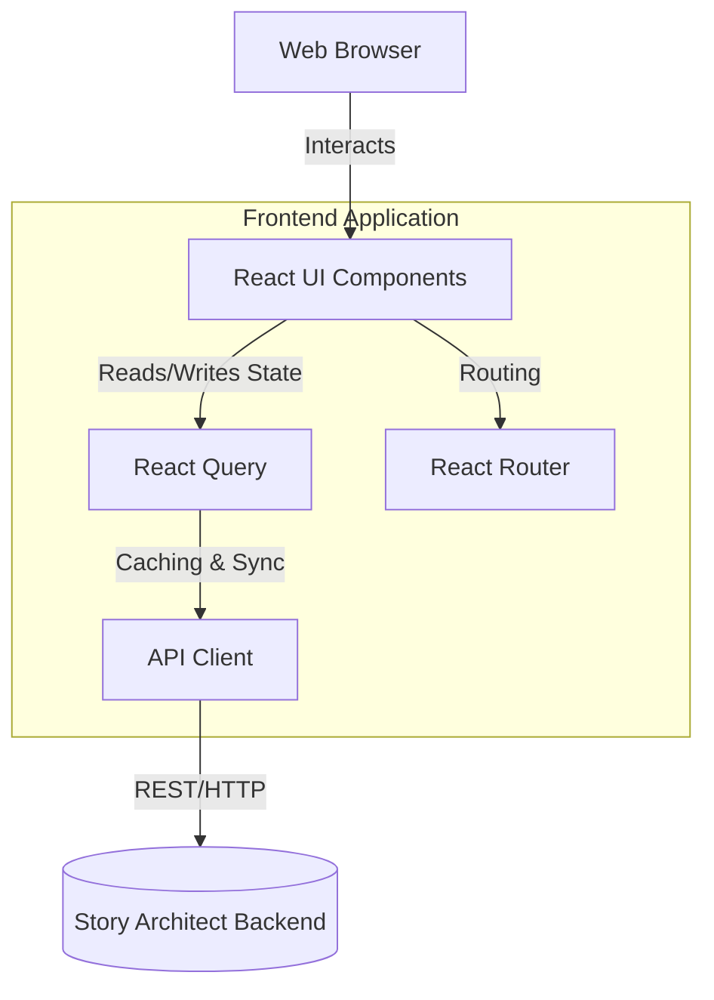

# Story Architect Web

Story Architect is a web application that helps writers discover character architecture, relationship architecture, and dramatic structure through guided discovery.

Instead of feeling like a questionnaire, the application provides a **Living Discovery Experience**. As you answer guided questions, deterministic rules unlock deep insights into your characters' emotional wounds, deepest fears, protective lies, and relationship patterns, surfacing them dynamically.

## Features

- **Dynamic Command Center:** The Dashboard and Story Overview act as living workspaces, highlighting recent activity, your discovery journal, and what you should discover next.
- **Guided Character Discovery:** Answer intuitive questions to build your character.
- **Real-time Insights:** The "Character Pulse" tracks the character's emerging personality as you answer questions.
- **Transition Overlays:** As you answer questions, the system proactively detects patterns and unlocks insights, notifying you immediately with beautiful transition overlays.
- **Comprehensive Reports:** Generate in-depth Story Engine, Narrative Consequence, and Relationship Architecture reports entirely generated from deterministic analysis of your inputs.
- **Persistent Navigation:** Easily navigate between characters, relationships, and reports using the dynamic sidebar.

## Tech Stack

- **Framework:** React 18
- **Build Tool:** Vite
- **Language:** TypeScript
- **Routing:** React Router v6
- **Data Fetching & State:** React Query (@tanstack/react-query)
- **Styling:** CSS Modules with Vanilla CSS (Dark-mode, glassmorphism, responsive)
- **Icons:** Lucide React

## Architecture



## Getting Started

### Prerequisites
- Node.js (v18 or higher)
- npm or yarn

### Installation

1. Clone the repository:
   ```bash
   git clone https://github.com/story-architect/story-architect-web.git
   cd story-architect-web
   ```

2. Install dependencies:
   ```bash
   npm install
   ```

3. Run the development server:
   ```bash
   npm run dev
   ```

4. Open [http://localhost:5173](http://localhost:5173) in your browser.

*Note: You will need the Story Architect Backend running on `http://localhost:8000` for the application to fetch and save data.*

## Project Structure

- `src/api/` - API client and service definitions
- `src/components/`
  - `character/` - Character-specific components (e.g., CharacterPulse)
  - `discovery/` - Reusable discovery components (Journal, Overlays)
  - `layout/` - Shell, Sidebar, and TopNav
  - `story/` - Story-specific components (Activity Feed, Cards, Status)
  - `ui/` - Generic UI components (Button, Input, Card)
- `src/pages/` - Main route components
- `src/styles/` - Global CSS variables and base styles
- `src/types/` - TypeScript interface definitions for API responses

