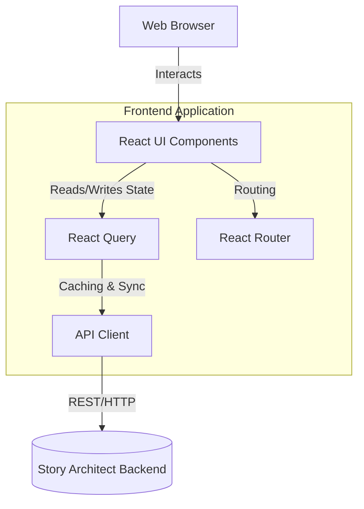

# Story Architect Web

Story Architect is a web application that helps writers discover character architecture, relationship architecture, and dramatic structure through guided discovery.

Instead of feeling like a questionnaire, the application provides a **Living Discovery Experience**. As you answer guided questions, deterministic rules unlock deep insights into your characters' emotional wounds, deepest fears, protective lies, and relationship patterns, surfacing them dynamically.

## Features

- **Dynamic Command Center:** The Dashboard and Story Overview act as living workspaces, highlighting recent activity, your discovery journal, and what you should discover next.
- **Guided Character Discovery:** Answer intuitive questions to build your character.
- **Real-time Insights:** The "Character Pulse" tracks the character's emerging personality as you answer questions.
- **Transition Overlays:** As you answer questions, the system proactively detects patterns and unlocks insights, notifying you immediately with beautiful transition overlays.
- **Comprehensive Reports:** Generate in-depth Story Engine, Narrative Consequence, and Relationship Architecture reports entirely generated from deterministic analysis of your inputs.
- **Persistent Navigation:** Easily navigate between characters, relationships, and reports using the dynamic sidebar.

## Tech Stack

- **Framework:** React 18
- **Build Tool:** Vite
- **Language:** TypeScript
- **Routing:** React Router v6
- **Data Fetching & State:** React Query (@tanstack/react-query)
- **Styling:** CSS Modules with Vanilla CSS (Dark-mode, glassmorphism, responsive)
- **Icons:** Lucide React

## Architecture



## Getting Started

### Prerequisites
- Node.js (v18 or higher)
- npm or yarn

### Installation

1. Clone the repository:
   ```bash
   git clone https://github.com/story-architect/story-architect-web.git
   cd story-architect-web
   ```

2. Install dependencies:
   ```bash
   npm install
   ```

3. Run the development server:
   ```bash
   npm run dev
   ```

4. Open [http://localhost:5173](http://localhost:5173) in your browser.

*Note: You will need the Story Architect Backend running on `http://localhost:8000` for the application to fetch and save data.*

## Project Structure

- `src/api/` - API client and service definitions
- `src/components/`
  - `character/` - Character-specific components (e.g., CharacterPulse)
  - `discovery/` - Reusable discovery components (Journal, Overlays)
  - `layout/` - Shell, Sidebar, and TopNav
  - `story/` - Story-specific components (Activity Feed, Cards, Status)
  - `ui/` - Generic UI components (Button, Input, Card)
- `src/pages/` - Main route components
- `src/styles/` - Global CSS variables and base styles
- `src/types/` - TypeScript interface definitions for API responses

---

## Product North Star & Feature Governance

This document defines the identity of Story Architect.

Its purpose is to protect the product from feature creep and ensure all future development strengthens the core vision.

### Product North Star

Story Architect helps writers discover:

* Emotional Architecture
* Dramatic Architecture
* Relationship Architecture

The product becomes valuable when it helps writers understand their stories.
The product does NOT become valuable by helping writers store more information.

Story Architect is a discovery platform.
Not a storage platform.

### Core Product Question

Before implementing any new feature ask:
"Does this help the writer discover emotional or dramatic architecture?"

If YES: The feature may belong in Story Architect.
If NO: The feature likely belongs to a different product category.

### What Makes Story Architect Different

Many writing tools help writers organize information. (e.g. Notes, Chapters, Timelines, Worldbuilding, Drafts)

Story Architect is different. Its purpose is helping writers answer questions such as:
- Who is this character?
- Why do they behave this way?
- What emotional wound drives them?
- What dramatic consequences emerge?
- What conflict naturally appears?
- What transformation is required?
- What happens when two people collide emotionally?

This is the core identity of the product.

### Product-Specific Concepts

The following concepts are part of Story Architect's unique language. These concepts should continue evolving.

Character Architecture Report, Relationship Architecture Report, Discovery Event, Discovery Journal, Pattern Emerging, Insight Unlocked, Narrative Consequence, Conflict Created, Pressure Point, Transformation Path, Relationship Risk, Relationship Cost, Relationship Turning Point, Story Engine.

These concepts are more important than generic writing features.

### Current Focus

Priority Areas:
* Emotional Architecture
* Character Discovery
* Relationship Discovery
* Discovery Events
* Discovery Journal
* Revision Support
* Refresh Architecture
* Character-Driven Dramatic Architecture
* Relationship-Driven Dramatic Architecture

The goal is depth. Not breadth.

### Features Explicitly Out Of Scope

Do NOT implement the following:
Worldbuilding, Timeline Management, Scene Planning, Chapter Planning, Draft Editor, Character Chat, Maps, Magic Systems, Lore Encyclopedias, AI Writing Assistant, Interactive Storyboards, Novel Writing Workspace, Publishing Tools.

These belong to different product categories. Adding them risks diluting Story Architect's identity.

### Product Evolution Roadmap

**Layer 1: Emotional Architecture**
Questions: What hurt this character? What do they fear? What lie protects them? What behavior emerges?
Outputs: Character Architecture, Relationship Architecture

**Layer 2: Character-Driven Dramatic Architecture**
Questions: What behavior protects the character? What consequence does it create? What conflict emerges? What pressure threatens the lie? What transformation is required?
Outputs: Narrative Consequence, Conflict Created, Pressure Point, Transformation Path, Story Engine

**Layer 3: Relationship-Driven Dramatic Architecture**
Questions: How do two character patterns interact? What relationship risk emerges? What cost exists? What turning point is required?
Outputs: Relationship Pattern, Relationship Risk, Relationship Cost, Relationship Turning Point, Relationship Engine

**Layer 4: Event-Driven Dramatic Architecture**
Questions: What event threatens the lie? What event escalates the conflict? What event breaks the pattern? What event forces transformation?
Important: Events are consequences. Events are not the starting point.
Outputs: Threatening Event, Escalation Event, Breaking Point Event, Transformation Event

### Decision Rule

When considering a new feature:

**Step 1:** Ask: "Does this deepen discovery?" If no: Reject or defer.
**Step 2:** Ask: "Does this strengthen emotional architecture?" If no: Reject or defer.
**Step 3:** Ask: "Does this strengthen dramatic architecture?" If no: Reject or defer.

### Final Principle

Story Architect should become deeper. Not broader.
The goal is not to become another writing application.
The goal is to become the best platform for discovering why stories work.
